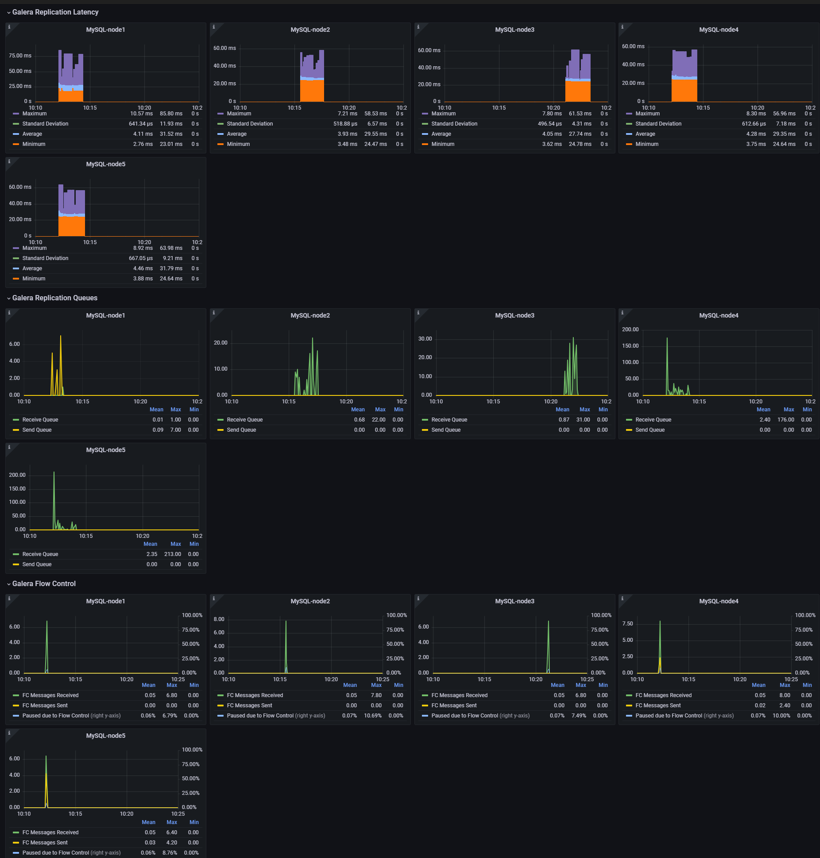

# Monitoring with Percona Monitoring and Management (PMM)

## Monitoring Objective
Monitoring is implemented to provide real-time visibility into system health,
resource utilization, and replication behavior during normal operation and
stress scenarios.

---

## Metrics Observed

### System Metrics
- CPU utilization
- Memory usage
- Disk I/O
- Network throughput

### Database Metrics
- Queries per second (QPS)
- Transactions per second (TPS)
- Connection count
- Query latency (P95)

### Galera Replication Metrics
- Replication queue size
- Apply latency
- Node state changes
- Flow control events

---

## Observations During Testing

### Normal Load (≤ 3000 Threads)
- Stable CPU and memory usage
- Low replication latency
- No flow control events
- Consistent TPS

### High Load (4500 Threads)
- CPU utilization approaching maximum
- Replication apply queue increasing
- Latency spikes observed
- Cluster remains operational

### Extreme Load (5000 Threads)
- CPU and memory reach 100%
- Replication delay increases significantly
- MySQL service restart detected
- Lost connection errors recorded

---

## Monitoring Outcome
PMM successfully captured performance degradation patterns and provided
clear indicators of resource saturation prior to system failure.
