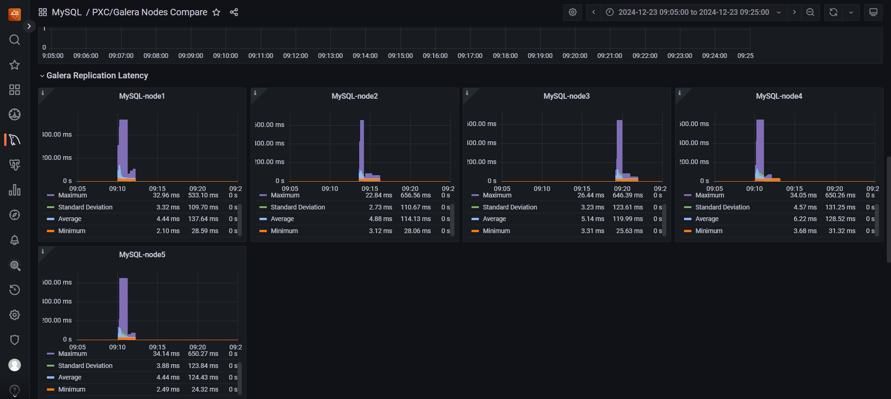

# Load Testing Using Sysbench



## Tool
Sysbench version 1.0

---

## Test Configuration

| Parameter | Value |
|--------|------|
| Tables | 10 |
| Rows per Table | 100,000 |
| Duration | 2 minutes |
| Threads | Up to 5000 |
| Queries | INSERT, DELETE, UPDATE |
| SSL | Enabled |
| Report Interval | 1 second |

---

## Test Results Summary

### Optimal Range (≤ 3000 Threads)
- Stable TPS
- Low latency
- No replication delay
- System operates normally

---

### Degradation Phase (4500 Threads)
- TPS fluctuates
- Latency increases significantly
- Replication apply queue starts growing
- CPU utilization near maximum

---

### Failure Scenario (5000 Threads)

#### Symptoms
- TPS dropped to 0–117
- Latency exceeded 20 seconds
- MySQL service restarted
- CPU and memory reached 100%

#### Sample Error Output
```bash
FATAL: mysql_stmt_execute() returned error 2013
(Lost connection to MySQL server during query)
```


#### Sample Metrics
- TPS unstable
- QPS fluctuating
- Latency up to ~28 seconds
- Reconnection attempts failed

---

## Root Cause Analysis
The failure was caused by hardware resource exhaustion rather than
architectural or replication design flaws.

---

## Sysbench Limitation
Sysbench reports timeout errors but cannot terminate long-running queries,
which contributes to prolonged resource saturation.

---

## Conclusion
The cluster is stable up to 3000 threads and exhibits predictable degradation
behavior beyond that threshold.
